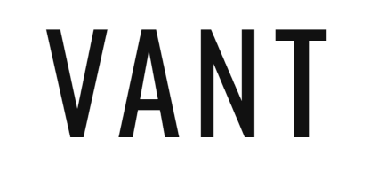

# VANT | E-commerce Concept



> Minimalist Streetwear Store. Focada em uma experiência de usuário fluida, estética "high-end" e performance visual.

---

## 📍 Índice 

* [⚡ Sobre o Projeto](#-sobre-o-projeto)
* [🌐 Acesso Online](#-acesso-online)
* [🚀 Funcionalidades Principais](#-funcionalidades-principais)
* [🛠️ Tecnologias Utilizadas](#️-tecnologias-utilizadas)
* [📂 Estrutura de Pastas](#-estrutura-de-pastas)
* [📝 Licença](#-licença)
* [👥 Autores](#-autores)

---

## ⚡ Sobre o Projeto

O **VANT** é um projeto de e-commerce de moda (streetwear/lifestyle) desenvolvido para ser leve, responsivo e visualmente impactante. O design é inspirado em grandes players do mercado esportivo, utilizando tipografias modernas (Inter, Montserrat, Oswald) e uma paleta de cores monocromática com detalhes em preto absoluto.

---

## 🌐 Acesso Online

Você pode acessar o site diretamente aqui: **[Clique aqui para visitar o site](SEU_LINK_AQUI)**

---

## 🚀 Funcionalidades Principais

* **Carrossel Imersivo:** Hero banner com transições suaves e autoplay inteligente (pausa quando a aba não está visível).
* **Catálogo Dinâmico:** Sistema de filtragem por categoria, coleção, preço e produtos em oferta.
* **Gestão de Carrinho Lateral:** Experiência de compra sem recarregamento de página (AJAX-like).
* **Sistema de Favoritos:** Lista de desejos persistente que permite ao usuário salvar itens de interesse durante a navegação.
* **Página de Produto (PDP) Avançada:** Experiência detalhada com galeria interativa, seleção dinâmica de variantes (cores/tamanhos) e sistema de zoom.
* **Smart Discount Tags:** Cálculo e exibição automática de etiquetas de promoção (ex: -20% OFF) baseadas em `oldPrice`.
* **Efeito Hover Avançado:** Troca dinâmica de imagens nos cards de produtos para visualização rápida de detalhes (frente/costas).

## 🛠️ Tecnologias Utilizadas

O projeto foi construído utilizando o conceito de **Vanilla Web Development**, garantindo máxima velocidade de carregamento e código limpo:

* **HTML5:** Estrutura semântica.
* **CSS3:** Layouts modernos (Flexbox/Grid), Variáveis CSS e Animações suaves.
* **JavaScript (ES6+):** Engine central que processa toda a inteligência do e-commerce, desde a gestão de dados até as interações dinâmicas da interface.
* **Google Fonts:** Oswald, Inter e Montserrat (Tipografia selecionada para estética Streetwear).

## 📂 Estrutura de Pastas

```text
VANT/
├── Assets/
│   ├── img/
│   │   ├── Banners/    # Banners principais do carrossel
│   │   ├── roupas/     # Fotos dos produtos (Main e Hover)
│   │   └── icones/     # Logotipos e ícones de interface
├── css/
│   ├── base.css        # Resets, fontes e variáveis globais
│   ├── catalogo.css    # Layout da grade de produtos com filtros
│   ├── header.css      # Estilos da navegação, busca, favoritos e carrinho
│   ├── index.css       # Estilos específicos da Home e Carrossel
│   └── produto.css     # Estilos da página de detalhes do produto
├── js/
│   ├── base.js         # Funções utilitárias globais
│   ├── catalogo.js     # Lógica de filtros e busca
│   ├── header.js       # Controle do menu
│   ├── index.js        # Lógica do carrossel e seção Novidades
│   ├── produto.js      # Scripts da página do produto
│   └── produtos-data.js # Estrutura central de dados (JSON) que gerencia todo o inventário
├── catalogo.html       # Página de listagem e filtros
├── index.html          # Ponto de entrada (Home)
└── produto.html        # Página de exibição de produto individual
```

## 📝 Licença

Este projeto está sob a licença **MIT**. Veja o arquivo [LICENSE](LICENSE.md) para mais detalhes.

## 👥 Autores

* **Lucas Boesel** - [Meu GitHub](https://github.com/LucasBoesel)
